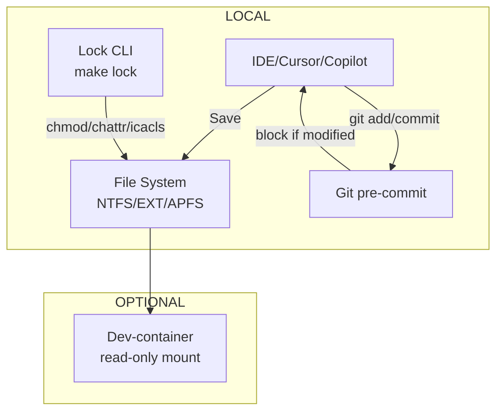

# AI-Proof File Guard 产品需求文档

## 项目概览

### 项目名称
AI-Proof File Guard (ailock)

### 愿景
在保持 AI 读取权限的前提下，从机制上杜绝任何自动写盘/误提交对敏感文件造成破坏，为单人及小团队提供"一键加锁/解锁 + 流程钩子"方案。

### 核心指标
- **0 次**因 AI/脚本误改导致的 .env、配置、秘钥文件损坏
- 锁/解锁操作 **< 2s** 完成
- **100%** 跨平台：Linux、macOS、Windows、WSL、容器一致

## 1. 用户画像 & 关键痛点

| 角色 | 行为 | 痛点 |
|------|------|------|
| DevOps/后端工程师 | 让 Copilot/Claude 重构大量脚本 | .env 与部署 YAML 被批量覆盖 |
| 全栈开发者 | Cursor「AI Apply」一键改仓库 | 改动含秘钥的配置文件难以发现 |
| 教培机构/学员 | 共享示例仓库、在线编辑器 | 误删模板 Service 文件，课程无法运行 |

## 2. MVP 定义（8-10 人/日可交付）

| 范畴 | MVP 必含 | 缺省延后 |
|------|----------|----------|
| **锁机制** | - OS 级：chmod -w / chattr +i / attrib +R - make lock / make unlock（跨平台脚本） | icacls ACL 细粒度继承 |
| **工作流钩子** | pre-commit 钩子，若检测改动锁定文件则 abort | 服务端 pre-receive 钩子 |
| **配置文件** | .ailock（等同 .gitignore 语法） | 图形化编辑器 |
| **文档** | README + Quick Start + FAQ | 多语言版本 |
| **测试** | 单元测试覆盖脚本核心逻辑；GitHub Actions Matrix（Ubuntu/macOS/Windows） | 性能基准、嵌入式设备适配 |
| **分发** | NPM 包 @pod0/ailock-cli + GitHub Release tarball | Homebrew / WinGet |

## 3. 系统设计概览

- **CLI 层**：修改文件系统元数据→即时保护
- **Hook 层**：兜底防止跳过 CLI 直接写改并提交
- **可选容器层**：在 remote dev 环境复用同一锁态

## 4. 关键模块

| 模块 | 说明 | 技术点 |
|------|------|--------|
| **Lock Engine** | 解析 glob → 找到匹配文件 → 调用平台特定 API 设只读位 | node-glob + execa |
| **Config Loader** | 支持 .ailock、CLI 参数数组及 JSON | 同 .gitignore 优先级 |
| **Git Guard** | Hook Script，依赖 git diff --cached 检测命中 | 与 pre-commit 框架兼容 |
| **Cross-Platform Wrapper** | Bash + PowerShell 双实现 | WSL 自动探测文件系统类型 |

## 5. 分阶段实施计划

| 阶段 | 时间 | 交付 | 里程碑 Gate |
|------|------|------|-------------|
| **P0 需求冻结** | Day 0-1 | 最小 .ailock 语法 & 场景列表 | TE & PM 评审 |
| **P1 MVP 实现** | Day 2-6 | CLI (lock/unlock/status)、Git hook、README | 单人本地用例通过 |
| **P2 跨平台 CI** | Day 7-9 | GitHub Actions Matrix、Windows PowerShell 支持 | 三系统自动测试全绿 |
| **P3 包管理分发** | Day 10-12 | 发布 NPM 包、生成 Homebrew Formula PR | npm install -g 成功 |
| **P4 Dev-container 集成** | Day 13-15 | 模板 devcontainer.json + 文档 | Codespaces Demo 跑通 |
| **P5 IDE 插件 PoC** | Day 16-22 (可延后) | VS Code 扩展拦截保存事件 | 内部灰度使用 |

## 6. 里程碑验收标准（Definition of Done）

1. **锁态验证脚本**：往受保护文件写入→应出现 EACCES 或 Git hook error
2. **解除锁**：`make unlock && echo test >> .env` 应成功
3. **提交保护**：改动后直接 `git commit -am` → Hook Block
4. **跨平台测试**：在 Ubuntu 22.04 / macOS 14 / Windows 11（三平台）CI 通过
5. **文档完备**：30 min 内新同学可按照 README 完成安装与首个锁文件

## 7. MVP 工作量预估

| 角色/任务 | 人日 |
|-----------|------|
| TypeScript CLI & glob 解析 | 2 |
| Bash + PowerShell 实现 & 测试 | 2 |
| Git hook 包装 & pre-commit 集成 | 1 |
| CI Pipeline (Matrix) | 1 |
| 文档 & 示例 Makefile | 1 |
| **合计** | **7 人/日** |

## 8. 风险与缓解

| 风险 | 级别 | 缓解 |
|------|------|------|
| Windows ACL 复杂度 | 中 | 先实现 attrib +R; ACL 细粒度放后续 |
| WSL 混合文件系统 | 低 | 检测 `stat -f -c %T`，在 NTFS 上回退 ACL |
| 用户跳过 CLI 直接 chmod | 低 | Git hook 仍能阻断 commit |
| VS Code 扩展 API 变动 | 低 | MVP 不依赖官方未定 API |

## 9. 未来 Roadmap（非 MVP）

| 版本 | 特性 | 价值 |
|------|------|------|
| v0.9 | VS Code 插件 GUI（右键 Lock） | 降低命令行门槛 |
| v1.0 | 服务器端 pre-receive / GitHub App | 组织级防线 |
| v1.1 | LFS lock 自动联动 | 多人协作冲突消解 |
| v1.2 | Secret Scanner 联动（commit msg 注入） | 提前阻断敏感信息外泄 |
| v2.0 | Web Dashboard + Audit Log | 合规与审计场景 |

## 10. 行动项

- [x] 锁定需求表 & 受保护文件模式（今日 17:00 前）
- [ ] 启动 P1 分支：`npx degit pod0/ailock-skeleton`
- [ ] 每日 Stand-up 聚焦阻断差异化平台问题；遇到 ACL 难题优先同步

---

**总结**：只需一周即可交付 MVP，先给团队一个「可用即安全」的最小护栏；随后再按业务增量完善 IDE、CI、协作层。