# AI-Proof File Guard - Introduction

## 🎯 What is AI-Proof File Guard?

AI-Proof File Guard is a comprehensive security system designed to protect file operations from malicious AI interactions and other security threats. It provides multiple layers of defense against common attack vectors while maintaining usability for legitimate operations.

## 🚨 The Problem

Modern applications face increasing security threats, especially when dealing with AI systems that might attempt:

```mermaid
graph TD
    A[AI System] --> B{Malicious Intent?}
    B -->|Yes| C[Command Injection]
    B -->|Yes| D[Path Traversal]
    B -->|Yes| E[File System Abuse]
    B -->|Yes| F[Information Disclosure]
    
    C --> G[💥 System Compromise]
    D --> G
    E --> G
    F --> G
```



### Common Attack Vectors

1. **Command Injection** - Executing arbitrary system commands
2. **Path Traversal** - Accessing files outside allowed directories
3. **Race Conditions** - Exploiting timing vulnerabilities
4. **Information Disclosure** - Extracting sensitive system information

## 💡 The Solution

AI-Proof File Guard provides a multi-layered security approach:

```mermaid
graph TD
    A[User Request] --> B[Input Validation Layer]
    B --> C[Path Sanitization Layer]
    C --> D[Command Security Layer]
    D --> E[Atomic Operations Layer]
    E --> F[Error Handling Layer]
    F --> G[Secure Response]
    
    B -->|❌ Reject| H[Security Alert]
    C -->|❌ Reject| H
    D -->|❌ Reject| H
    E -->|❌ Reject| H
    F --> I[Sanitized Error]
```



## 🔧 Core Components

### 1. SecurePathValidator
Validates and sanitizes file paths to prevent directory traversal attacks.

```typescript
// Example: Dangerous path gets sanitized
const dangerous = "../../../etc/passwd";
const safe = await validator.validateAndSanitizePath(dangerous);
// Result: Safely contained within allowed directory
```

### 2. SecureCommandExecutor
Executes commands safely with whitelist validation and argument sanitization.

```typescript
// Example: Only whitelisted commands allowed
const executor = new SecureCommandExecutor(['ls', 'cat', 'echo']);
await executor.executeCommand('ls', ['-la']); // ✅ Allowed
await executor.executeCommand('rm', ['-rf', '/']); // ❌ Blocked
```

### 3. AtomicFileManager
Provides race-condition-free file operations with proper locking.

```typescript
// Example: Atomic file operations
const lockId = await manager.acquireLock(filePath);
await manager.atomicWrite(filePath, content);
await manager.releaseLock(filePath, lockId);
```

### 4. SecureErrorHandler
Sanitizes error messages to prevent information disclosure.

```typescript
// Example: Sensitive info gets redacted
const error = new Error("Failed to access /Users/admin/.ssh/id_rsa");
const sanitized = errorHandler.handle(error);
// Result: "Failed to access [REDACTED]"
```

## 🎯 Use Cases

### 1. AI-Powered Applications


### 2. Multi-User Environments
- Prevent users from accessing each other's files
- Ensure operations don't interfere with each other
- Maintain audit trails for security compliance

### 3. Production Systems
- Protect against injection attacks
- Ensure system stability under load
- Provide secure error reporting

## 📊 Security Benefits

| Feature | Without Guard | With Guard |
|---------|---------------|------------|
| Path Traversal | `../../../etc/passwd` → System compromise | `../../../etc/passwd` → Blocked & logged |
| Command Injection | `; rm -rf /` → System destruction | `; rm -rf /` → Blocked & logged |
| Race Conditions | Multiple writes → Data corruption | Multiple writes → Serialized safely |
| Error Disclosure | `/Users/admin/.ssh/id_rsa not found` | `[REDACTED] not found` |

## 🚀 Getting Started

Ready to secure your application? Head to the [Quick Start Guide](./02-quick-start.md) to begin implementation.

## 🔗 Next Steps

1. **[Quick Start Guide](./02-quick-start.md)** - Get up and running in minutes
2. **[System Architecture](../02-architecture/01-system-architecture.md)** - Understand the design
3. **[Security Implementation](../03-security/01-security-implementation.md)** - Deep dive into security features

---

*🔐 Security is not optional - it's essential. Start protecting your applications today!*