# Quick Start Guide

Get AI-Proof File Guard up and running in your project in just a few minutes!

## 🚀 Installation

```bash
npm install ailock
# or
yarn add ailock
```

## 📦 Basic Setup

### 1. Import the Core Components

```typescript
import {
  SecurePathValidator,
  SecureCommandExecutor,
  AtomicFileManager,
  SecureErrorHandler
} from 'ailock';
```

### 2. Initialize Security Components

```typescript
// Set up path validation for your allowed directories
const pathValidator = new SecurePathValidator([
  '/safe/directory',
  './project/files'
]);

// Configure command execution with allowed commands
const commandExecutor = new SecureCommandExecutor([
  'ls', 'cat', 'echo', 'chmod'
]);

// Set up atomic file operations
const fileManager = new AtomicFileManager('./workspace');

// Configure secure error handling
const errorHandler = new SecureErrorHandler({
  sanitizeMessages: true,
  includeStackTrace: false,
  logErrors: true
});
```

## 🛡️ Basic Usage Examples

### Secure File Path Validation

```typescript
async function safeFileAccess(userPath: string) {
  try {
    // Validate and sanitize the path
    const safePath = await pathValidator.validateAndSanitizePath(
      userPath, 
      '/safe/directory'
    );
    
    // Now safely work with the file
    console.log(`Accessing safe path: ${safePath}`);
    
  } catch (error) {
    // Path traversal attempt blocked!
    console.error('Invalid path detected:', error.message);
  }
}

// Examples
await safeFileAccess('document.txt');        // ✅ Allowed
await safeFileAccess('../../../etc/passwd'); // ❌ Blocked
```

### Secure Command Execution

```typescript
async function safeCommandExecution(command: string, args: string[]) {
  try {
    const result = await commandExecutor.executeCommand(command, args);
    console.log('Command output:', result.stdout);
    
  } catch (error) {
    console.error('Command blocked:', error.message);
  }
}

// Examples
await safeCommandExecution('ls', ['-la']);           // ✅ Allowed
await safeCommandExecution('rm', ['-rf', '/']);      // ❌ Blocked
await safeCommandExecution('echo', ['; malicious']); // ❌ Blocked
```

### Atomic File Operations

```typescript
async function safeFileWrite(filePath: string, content: string) {
  let lockId: string | null = null;
  
  try {
    // Acquire exclusive lock
    lockId = await fileManager.acquireLock(filePath);
    
    // Perform atomic write
    await fileManager.atomicWrite(filePath, content);
    
    console.log('File written safely');
    
  } catch (error) {
    const safeError = errorHandler.handle(error);
    console.error('Write failed:', safeError.message);
    
  } finally {
    // Always release lock
    if (lockId) {
      await fileManager.releaseLock(filePath, lockId);
    }
  }
}
```

### Secure Error Handling

```typescript
async function handleOperationWithSecureErrors() {
  try {
    // Some operation that might fail
    await fs.readFile('/sensitive/path/file.txt');
    
  } catch (error) {
    // Sanitize error to prevent information disclosure
    const secureError = errorHandler.handle(error, {
      operation: 'file_read',
      timestamp: new Date().toISOString()
    });
    
    // Safe to log or return to user
    console.log('Operation failed:', secureError.message);
    // Output: "Operation failed: [REDACTED]"
  }
}
```

## 🔄 Complete Workflow Example

Here's a complete example showing all components working together:

```typescript
import { 
  SecurePathValidator, 
  SecureCommandExecutor, 
  AtomicFileManager,
  SecureErrorHandler 
} from 'ailock';

class SecureFileProcessor {
  private pathValidator: SecurePathValidator;
  private commandExecutor: SecureCommandExecutor;
  private fileManager: AtomicFileManager;
  private errorHandler: SecureErrorHandler;

  constructor() {
    this.pathValidator = new SecurePathValidator(['/safe/workspace']);
    this.commandExecutor = new SecureCommandExecutor(['cat', 'echo', 'ls']);
    this.fileManager = new AtomicFileManager('/safe/workspace');
    this.errorHandler = new SecureErrorHandler({
      sanitizeMessages: true,
      includeStackTrace: false
    });
  }

  async processFile(userPath: string, command: string, args: string[]) {
    try {
      // 1. Validate path
      const safePath = await this.pathValidator.validateAndSanitizePath(userPath);
      
      // 2. Execute command securely
      const result = await this.commandExecutor.executeCommand(command, [
        ...args,
        safePath
      ]);
      
      // 3. Write result atomically
      const outputPath = `${safePath}.processed`;
      await this.fileManager.atomicWrite(outputPath, result.stdout);
      
      return { success: true, output: outputPath };
      
    } catch (error) {
      // 4. Handle errors securely
      const secureError = this.errorHandler.handle(error);
      return { 
        success: false, 
        error: secureError.message 
      };
    }
  }
}

// Usage
const processor = new SecureFileProcessor();

const result = await processor.processFile(
  'document.txt',
  'cat',
  ['--number']
);

console.log(result);
```

## 🔍 Security Flow Diagram

```mermaid
graph TD
    A[User Input] --> B{Path Validation}
    B -->|✅ Valid| C{Command Validation}
    B -->|❌ Invalid| I[Block & Log]
    
    C -->|✅ Safe| D{Acquire Lock}
    C -->|❌ Dangerous| I
    
    D -->|✅ Locked| E[Execute Operation]
    D -->|❌ Failed| J[Timeout Error]
    
    E --> F{Operation Result}
    F -->|✅ Success| G[Release Lock]
    F -->|❌ Error| H[Sanitize Error]
    
    G --> K[Return Success]
    H --> L[Return Safe Error]
    I --> L
    J --> L
```



## ⚙️ Configuration Options

### Path Validator Options
```typescript
const pathValidator = new SecurePathValidator(
  ['/allowed/dir1', '/allowed/dir2'], // Allowed directories
  {
    maxPathLength: 1000,
    maxComponentLength: 255,
    allowSymlinks: false,
    strictMode: true
  }
);
```

### Command Executor Options
```typescript
const commandExecutor = new SecureCommandExecutor(
  ['ls', 'cat', 'echo'], // Whitelisted commands
  {
    timeout: 30000,        // 30 second timeout
    maxOutputSize: 1024,   // 1KB output limit
    env: {},               // Clean environment
    shell: false           // No shell access
  }
);
```

### Error Handler Options
```typescript
const errorHandler = new SecureErrorHandler({
  sanitizeMessages: true,     // Remove sensitive info
  includeStackTrace: false,   // Hide stack traces
  logErrors: true,           // Log to console
  maxContextSize: 1000,      // Limit context size
  failSafe: true             // Default to secure behavior
});
```

## 🎯 Next Steps

Now that you have the basics working:

1. **[Learn the Architecture](../02-architecture/01-system-architecture.md)** - Understand how it all works
2. **[Explore Security Features](../03-security/01-security-implementation.md)** - Deep dive into protection mechanisms
3. **[Review API Documentation](../04-api/01-core-api.md)** - Master all available features
4. **[Configure for Production](../05-deployment/03-production.md)** - Deploy securely

## 🆘 Common Issues

### Path Validation Errors
```typescript
// Problem: Path rejected
// Solution: Ensure path is within allowed directories
const validator = new SecurePathValidator([process.cwd()]);
```

### Command Not Allowed
```typescript
// Problem: Command not in whitelist
// Solution: Add to allowed commands
const executor = new SecureCommandExecutor(['ls', 'cat', 'your-command']);
```

### Lock Acquisition Failed
```typescript
// Problem: File already locked
// Solution: Implement retry logic or check lock status
const isLocked = await fileManager.isFileLocked(filePath);
if (!isLocked) {
  const lockId = await fileManager.acquireLock(filePath);
}
```

---

*🎉 Congratulations! You now have AI-Proof File Guard protecting your application. Your files are secure!*