# Use Cases & Examples

Discover how AI-Proof File Guard solves real-world security challenges across different scenarios.

## 🤖 AI-Powered Applications

### Scenario: AI Code Assistant

An AI assistant that helps developers by reading, analyzing, and modifying code files.


**Implementation:**
```typescript
class AICodeAssistant {
  private pathValidator = new SecurePathValidator(['./project']);
  private fileManager = new AtomicFileManager('./project');
  private errorHandler = new SecureErrorHandler({
    sanitizeMessages: true,
    includeStackTrace: false
  });

  async readFile(aiRequestedPath: string) {
    try {
      // AI might try path traversal
      const safePath = await this.pathValidator.validateAndSanitizePath(
        aiRequestedPath
      );
      
      const content = await this.fileManager.atomicRead(safePath);
      return { success: true, content };
      
    } catch (error) {
      const safeError = this.errorHandler.handle(error);
      return { 
        success: false, 
        message: "I can only access files in your project directory" 
      };
    }
  }
}
```

### Scenario: AI-Powered Build System

An AI that optimizes build processes by analyzing project structure and running build commands.

```typescript
class AIBuildOptimizer {
  private commandExecutor = new SecureCommandExecutor([
    'npm', 'yarn', 'tsc', 'webpack', 'rollup', 'vite'
  ]);

  async optimizeBuild(aiSuggestedCommand: string, args: string[]) {
    try {
      // AI suggests: npm run build
      // Malicious AI might try: npm run build; rm -rf /
      
      const result = await this.commandExecutor.executeCommand(
        aiSuggestedCommand, 
        args
      );
      
      return {
        success: true,
        output: result.stdout,
        executionTime: result.duration
      };
      
    } catch (error) {
      return {
        success: false,
        error: "Build command not allowed or contains dangerous patterns"
      };
    }
  }
}
```

## 🏢 Multi-Tenant Applications

### Scenario: Cloud IDE Platform

A cloud-based development environment where multiple users work on isolated projects.

```mermaid
graph TD
    A[User A] --> B[Workspace A]
    C[User B] --> D[Workspace B]
    E[User C] --> F[Workspace C]
    
    B --> G[AI-Proof Guard]
    D --> G
    F --> G
    
    G --> H{Path Validation}
    H -->|User A files| I[/workspaces/user-a/]
    H -->|User B files| J[/workspaces/user-b/]
    H -->|User C files| K[/workspaces/user-c/]
    
    H -->|❌ Cross-user access| L[Block & Log]
```



**Implementation:**
```typescript
class CloudIDEManager {
  private validators = new Map<string, SecurePathValidator>();
  private fileManagers = new Map<string, AtomicFileManager>();

  constructor() {
    // Each user gets isolated validator and file manager
  }

  async setupUserWorkspace(userId: string) {
    const userWorkspace = `/workspaces/${userId}`;
    
    this.validators.set(userId, new SecurePathValidator([userWorkspace]));
    this.fileManagers.set(userId, new AtomicFileManager(userWorkspace));
  }

  async userFileOperation(userId: string, operation: string, path: string) {
    const validator = this.validators.get(userId);
    const fileManager = this.fileManagers.get(userId);
    
    if (!validator || !fileManager) {
      throw new Error('User workspace not initialized');
    }

    try {
      // Ensure user can only access their own files
      const safePath = await validator.validateAndSanitizePath(path);
      
      switch (operation) {
        case 'read':
          return await fileManager.atomicRead(safePath);
        case 'write':
          return await fileManager.atomicWrite(safePath, content);
        default:
          throw new Error('Invalid operation');
      }
      
    } catch (error) {
      // User A trying to access User B's files gets blocked
      throw new Error('Access denied: Invalid file path');
    }
  }
}
```

## 🔄 CI/CD Pipelines

### Scenario: Secure Deployment Pipeline

A CI/CD system that processes user-submitted build scripts and deployment configurations.


**Implementation:**
```typescript
class SecureCIPipeline {
  private commandExecutor = new SecureCommandExecutor([
    'npm', 'yarn', 'docker', 'kubectl', 'terraform'
  ]);
  
  private pathValidator = new SecurePathValidator([
    './build',
    './deploy', 
    './config'
  ]);

  async processBuildScript(scriptContent: string) {
    const commands = this.parseBuildScript(scriptContent);
    const results = [];

    for (const { command, args } of commands) {
      try {
        // Validate each command in the build script
        const result = await this.commandExecutor.executeCommand(command, args);
        results.push({
          command,
          success: true,
          output: result.stdout
        });
        
      } catch (error) {
        // Malicious command detected
        results.push({
          command,
          success: false,
          error: 'Command blocked for security reasons'
        });
        
        // Stop pipeline on security violation
        throw new Error('Build script contains dangerous commands');
      }
    }

    return results;
  }

  async validateDeploymentFiles(fileList: string[]) {
    for (const file of fileList) {
      try {
        await this.pathValidator.validateAndSanitizePath(file);
      } catch (error) {
        throw new Error(`Deployment blocked: ${file} is not in allowed directory`);
      }
    }
  }
}
```

## 📊 Data Processing Systems

### Scenario: User-Uploaded Script Processor

A system that allows users to upload and execute data processing scripts.

```typescript
class UserScriptProcessor {
  private scriptValidator = new SecurePathValidator(['./user-scripts']);
  private commandExecutor = new SecureCommandExecutor([
    'python3', 'node', 'ruby'
  ]);
  private fileManager = new AtomicFileManager('./user-data');

  async processUserScript(userId: string, scriptPath: string, dataFiles: string[]) {
    try {
      // 1. Validate script path
      const safeScriptPath = await this.scriptValidator.validateAndSanitizePath(
        scriptPath
      );

      // 2. Validate data file paths
      const safeDataFiles = [];
      for (const file of dataFiles) {
        const safeFile = await this.scriptValidator.validateAndSanitizePath(file);
        safeDataFiles.push(safeFile);
      }

      // 3. Execute in sandbox with limited permissions
      const result = await this.commandExecutor.executeCommand('python3', [
        safeScriptPath,
        ...safeDataFiles
      ], {
        timeout: 300000, // 5 minute limit
        maxOutputSize: 10 * 1024 * 1024, // 10MB output limit
        env: {
          // Restricted environment
          HOME: '/tmp/sandbox',
          PATH: '/usr/bin:/bin'
        }
      });

      // 4. Save results atomically
      const outputPath = `./results/${userId}-${Date.now()}.json`;
      await this.fileManager.atomicWrite(outputPath, JSON.stringify({
        userId,
        timestamp: new Date().toISOString(),
        output: result.stdout,
        exitCode: result.exitCode
      }));

      return { success: true, outputPath };

    } catch (error) {
      return {
        success: false,
        error: 'Script processing failed: Invalid script or data files'
      };
    }
  }
}
```

## 🌐 Web Applications

### Scenario: File Upload & Processing Service

A web service that accepts file uploads and processes them with user-defined operations.


**Implementation:**
```typescript
class FileProcessingService {
  private pathValidator = new SecurePathValidator(['./uploads', './processed']);
  private commandExecutor = new SecureCommandExecutor([
    'convert',  // ImageMagick
    'ffmpeg',   // Video processing
    'pandoc'    // Document conversion
  ]);
  private fileManager = new AtomicFileManager('./storage');

  async processUploadedFile(
    originalFilename: string, 
    processingType: string, 
    options: Record<string, string>
  ) {
    try {
      // 1. Sanitize uploaded filename
      const safeFilename = this.pathValidator.sanitizeConfigFilename(
        originalFilename
      );
      
      const uploadPath = `./uploads/${safeFilename}`;
      const outputPath = `./processed/${safeFilename}`;

      // 2. Build processing command safely
      const command = this.buildProcessingCommand(
        processingType, 
        uploadPath, 
        outputPath, 
        options
      );

      // 3. Execute processing with timeout
      const result = await this.commandExecutor.executeCommand(
        command.executable,
        command.args,
        { timeout: 60000 } // 1 minute limit
      );

      // 4. Verify output file was created
      const processedContent = await this.fileManager.atomicRead(outputPath);
      
      return {
        success: true,
        processedFile: outputPath,
        fileSize: processedContent.length
      };

    } catch (error) {
      return {
        success: false,
        error: 'File processing failed: Invalid operation or filename'
      };
    }
  }

  private buildProcessingCommand(type: string, input: string, output: string, options: any) {
    // Only allow predefined processing types
    switch (type) {
      case 'resize-image':
        return {
          executable: 'convert',
          args: [input, '-resize', options.size || '800x600', output]
        };
      case 'convert-video':
        return {
          executable: 'ffmpeg',
          args: ['-i', input, '-codec:v', 'libx264', output]
        };
      default:
        throw new Error('Unsupported processing type');
    }
  }
}
```

## 🔧 Development Tools

### Scenario: Code Analysis Tool

A development tool that analyzes codebases and generates reports, potentially integrated with AI assistance.

```typescript
class CodeAnalysisTool {
  private pathValidator = new SecurePathValidator(['./project']);
  private commandExecutor = new SecureCommandExecutor([
    'eslint', 'tsc', 'jest', 'prettier'
  ]);
  private errorHandler = new SecureErrorHandler({
    sanitizeMessages: true
  });

  async analyzeProject(projectPath: string, analysisType: string) {
    try {
      // Validate project is within allowed scope
      const safePath = await this.pathValidator.validateAndSanitizePath(
        projectPath
      );

      const results = {};

      // Run different analysis tools based on type
      if (analysisType.includes('lint')) {
        results.linting = await this.runLinter(safePath);
      }
      
      if (analysisType.includes('type-check')) {
        results.typeCheck = await this.runTypeChecker(safePath);
      }
      
      if (analysisType.includes('test')) {
        results.testing = await this.runTests(safePath);
      }

      return {
        success: true,
        analysis: results,
        projectPath: safePath
      };

    } catch (error) {
      const safeError = this.errorHandler.handle(error);
      return {
        success: false,
        error: safeError.message
      };
    }
  }

  private async runLinter(projectPath: string) {
    return await this.commandExecutor.executeCommand('eslint', [
      projectPath,
      '--format', 'json',
      '--max-warnings', '0'
    ]);
  }

  private async runTypeChecker(projectPath: string) {
    return await this.commandExecutor.executeCommand('tsc', [
      '--project', projectPath,
      '--noEmit',
      '--pretty'
    ]);
  }

  private async runTests(projectPath: string) {
    return await this.commandExecutor.executeCommand('jest', [
      '--rootDir', projectPath,
      '--coverage',
      '--json'
    ]);
  }
}
```

## 📈 Benefits Summary

| Use Case | Primary Threats | AI-Proof Guard Protection |
|----------|----------------|---------------------------|
| **AI Applications** | Path traversal, command injection | Path validation, command whitelisting |
| **Multi-tenant Systems** | Cross-tenant access, privilege escalation | Isolated validators, atomic operations |
| **CI/CD Pipelines** | Malicious build scripts, deployment attacks | Command validation, path restrictions |
| **Data Processing** | Script injection, resource abuse | Sandboxed execution, timeout limits |
| **Web Applications** | File upload attacks, processing exploits | Filename sanitization, safe processing |
| **Development Tools** | Code injection, unauthorized access | Tool whitelisting, secure error handling |

## 🎯 Implementation Patterns

### Pattern 1: Layered Security
```typescript
// Multiple validation layers
const request = await validateInput(userInput);
const safePath = await validatePath(request.path);
const safeCommand = await validateCommand(request.command);
const result = await executeSecurely(safeCommand, safePath);
```

### Pattern 2: Fail-Safe Defaults
```typescript
// Default to secure behavior
try {
  return await riskyOperation();
} catch (error) {
  return secureDefault();
}
```

### Pattern 3: Audit Everything
```typescript
// Log all security events
const result = await secureOperation();
await auditLog.record({
  operation: 'file_access',
  user: userId,
  path: safePath,
  result: result.success ? 'allowed' : 'blocked'
});
```

---

*🔒 These examples demonstrate how AI-Proof File Guard adapts to different security requirements while maintaining usability and performance.*