# System Architecture

Understanding the design and structure of AI-Proof File Guard's security system.

## 🏗️ High-Level Architecture

AI-Proof File Guard follows a modular, layered security architecture designed for defense in depth.


## 🔧 Core Components

### 1. Security Gateway
The main entry point that orchestrates all security operations.


### 2. Input Validation Layer
First line of defense against malicious input.

```mermaid
graph LR
    A[Raw Input] --> B[Type Validation]
    B --> C[Length Limits]
    C --> D[Character Filtering]
    D --> E[Pattern Matching]
    E --> F[Sanitized Input]
    
    B -->|❌| G[Reject]
    C -->|❌| G
    D -->|❌| G
    E -->|❌| G
```



**Implementation:**
```typescript
class InputValidationLayer {
  validateInput(input: any): ValidatedInput {
    // Type validation
    if (typeof input !== 'object') {
      throw new SecurityError('Invalid input type');
    }
    
    // Length limits
    if (JSON.stringify(input).length > MAX_INPUT_SIZE) {
      throw new SecurityError('Input too large');
    }
    
    // Character filtering
    const sanitized = this.sanitizeInput(input);
    
    // Pattern matching for known attacks
    this.detectAttackPatterns(sanitized);
    
    return sanitized;
  }
  
  private detectAttackPatterns(input: any): void {
    const dangerous = [
      /\.\.\//,           // Path traversal
      /[;&|`$()]/,        // Command injection
      /javascript:/i,     // Script injection
      /<script/i          // XSS attempts
    ];
    
    const inputStr = JSON.stringify(input);
    for (const pattern of dangerous) {
      if (pattern.test(inputStr)) {
        throw new SecurityError('Dangerous pattern detected');
      }
    }
  }
}
```

### 3. Path Security Layer
Handles all file path operations with comprehensive validation.


**Component Structure:**
```typescript
class PathSecurityLayer {
  constructor(
    private allowedDirectories: string[],
    private options: PathValidationOptions
  ) {}
  
  async validatePath(inputPath: string): Promise<string> {
    // Step 1: Normalize and resolve
    const normalizedPath = path.resolve(inputPath);
    
    // Step 2: Check allowed directories
    this.enforceDirectoryRestrictions(normalizedPath);
    
    // Step 3: Detect traversal attempts
    this.detectTraversalAttacks(inputPath, normalizedPath);
    
    // Step 4: Validate characters and components
    this.validatePathComponents(normalizedPath);
    
    // Step 5: Platform-specific validation
    this.platformSpecificValidation(normalizedPath);
    
    return normalizedPath;
  }
  
  private enforceDirectoryRestrictions(fullPath: string): void {
    const isAllowed = this.allowedDirectories.some(dir => 
      fullPath.startsWith(path.resolve(dir))
    );
    
    if (!isAllowed) {
      throw new SecurityError('Path outside allowed directories');
    }
  }
}
```

### 4. Command Security Layer
Secures command execution with whitelisting and argument validation.

```mermaid
sequenceDiagram
    participant App as Application
    participant CSL as Command Security Layer
    participant Whitelist as Command Whitelist
    participant ArgValidator as Argument Validator
    participant Executor as Process Executor
    
    App->>CSL: executeCommand(cmd, args)
    CSL->>Whitelist: isCommandAllowed(cmd)
    
    alt Command Allowed
        Whitelist->>CSL: ✅ Allowed
        CSL->>ArgValidator: validateArguments(args)
        
        alt Arguments Safe
            ArgValidator->>CSL: ✅ Safe
            CSL->>Executor: execute(cmd, args)
            Executor->>CSL: result
            CSL->>App: sanitized result
        else Arguments Dangerous
            ArgValidator->>CSL: ❌ Dangerous
            CSL->>App: SecurityError
        end
    else Command Blocked
        Whitelist->>CSL: ❌ Blocked
        CSL->>App: SecurityError
    end
```



**Architecture:**
```typescript
class CommandSecurityLayer {
  constructor(
    private allowedCommands: string[],
    private options: CommandExecutionOptions
  ) {}
  
  async executeCommand(
    command: string, 
    args: string[]
  ): Promise<ExecutionResult> {
    // Step 1: Command whitelist validation
    this.validateCommandAllowed(command);
    
    // Step 2: Argument validation and sanitization
    const safeArgs = this.validateArguments(args);
    
    // Step 3: Environment preparation
    const secureEnv = this.prepareSecureEnvironment();
    
    // Step 4: Execute with constraints
    const result = await this.executeWithConstraints(
      command,
      safeArgs,
      secureEnv
    );
    
    // Step 5: Output sanitization
    return this.sanitizeOutput(result);
  }
  
  private executeWithConstraints(
    command: string,
    args: string[],
    env: NodeJS.ProcessEnv
  ): Promise<RawExecutionResult> {
    return execa(command, args, {
      shell: false,           // No shell interpretation
      timeout: this.options.timeout,
      maxBuffer: this.options.maxOutputSize,
      env: env,
      stdio: 'pipe',
      windowsHide: true
    });
  }
}
```

### 5. File Operation Layer
Provides atomic, race-condition-free file operations.


**Lock Management:**
```typescript
class FileOperationLayer {
  private activeLocks = new Map<string, LockInfo>();
  
  async atomicOperation<T>(
    filePath: string,
    operation: (path: string) => Promise<T>
  ): Promise<T> {
    const lockId = await this.acquireLock(filePath);
    
    try {
      // Create backup if needed
      const backup = await this.createBackup(filePath);
      
      // Perform operation
      const result = await operation(filePath);
      
      // Verify integrity
      await this.verifyIntegrity(filePath);
      
      // Clean up backup
      await this.cleanupBackup(backup);
      
      return result;
      
    } catch (error) {
      // Restore from backup if operation failed
      await this.restoreFromBackup(filePath, backup);
      throw error;
      
    } finally {
      await this.releaseLock(filePath, lockId);
    }
  }
}
```

### 6. Error Handling Layer
Sanitizes errors to prevent information disclosure.


## 🔄 Data Flow Architecture

### Request Processing Flow


## 🏛️ Architectural Patterns

### 1. Defense in Depth
Multiple independent security layers that each provide protection:

```typescript
class DefenseInDepthProcessor {
  async processRequest(request: any): Promise<any> {
    // Layer 1: Input validation
    const validatedInput = await this.inputValidator.validate(request);
    
    // Layer 2: Path security
    const safePaths = await this.pathValidator.validatePaths(
      validatedInput.paths
    );
    
    // Layer 3: Command security
    const safeCommands = await this.commandValidator.validateCommands(
      validatedInput.commands
    );
    
    // Layer 4: Execution security
    const result = await this.secureExecutor.execute(
      safeCommands,
      safePaths
    );
    
    // Layer 5: Output sanitization
    return await this.outputSanitizer.sanitize(result);
  }
}
```

### 2. Fail-Safe Design
Default to secure behavior when uncertain:

```typescript
class FailSafeValidator {
  validateOperation(operation: unknown): boolean {
    try {
      // Attempt validation
      return this.strictValidation(operation);
    } catch (error) {
      // When in doubt, fail safely
      this.logSecurityEvent('validation_failed', { operation, error });
      return false;
    }
  }
}
```

### 3. Immutable Security State
Security configurations cannot be modified at runtime:

```typescript
class ImmutableSecurityConfig {
  private readonly config: SecurityConfiguration;
  
  constructor(config: SecurityConfiguration) {
    // Deep freeze to prevent modification
    this.config = Object.freeze(JSON.parse(JSON.stringify(config)));
  }
  
  // Only read operations allowed
  getConfiguration(): Readonly<SecurityConfiguration> {
    return this.config;
  }
}
```

## 📊 Performance Architecture

### Caching Strategy


### Resource Management
```typescript
class ResourceManager {
  private operationLimits = {
    maxConcurrentOperations: 100,
    maxMemoryUsage: 512 * 1024 * 1024, // 512MB
    maxExecutionTime: 30000, // 30 seconds
  };
  
  async executeWithLimits<T>(
    operation: () => Promise<T>
  ): Promise<T> {
    // Check resource availability
    await this.checkResourceLimits();
    
    // Track resource usage
    const tracker = this.startResourceTracking();
    
    try {
      return await Promise.race([
        operation(),
        this.timeoutPromise(this.operationLimits.maxExecutionTime)
      ]);
    } finally {
      tracker.stop();
    }
  }
}
```

## 🔍 Monitoring & Observability

### Metrics Collection


### Health Checks
```typescript
class SecurityHealthMonitor {
  async performHealthCheck(): Promise<HealthStatus> {
    const checks = await Promise.allSettled([
      this.checkInputValidation(),
      this.checkPathSecurity(),
      this.checkCommandSecurity(),
      this.checkFileOperations(),
      this.checkErrorHandling()
    ]);
    
    return {
      overall: checks.every(c => c.status === 'fulfilled') ? 'healthy' : 'degraded',
      components: this.summarizeChecks(checks),
      timestamp: new Date().toISOString()
    };
  }
}
```

---

*🏗️ This architecture ensures robust security while maintaining performance and extensibility.*