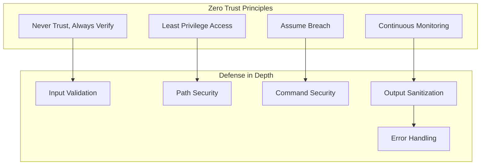
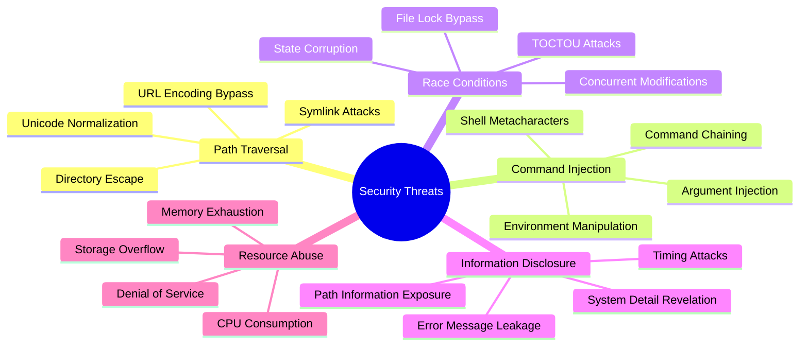
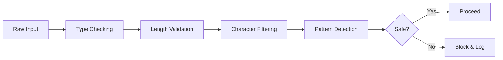
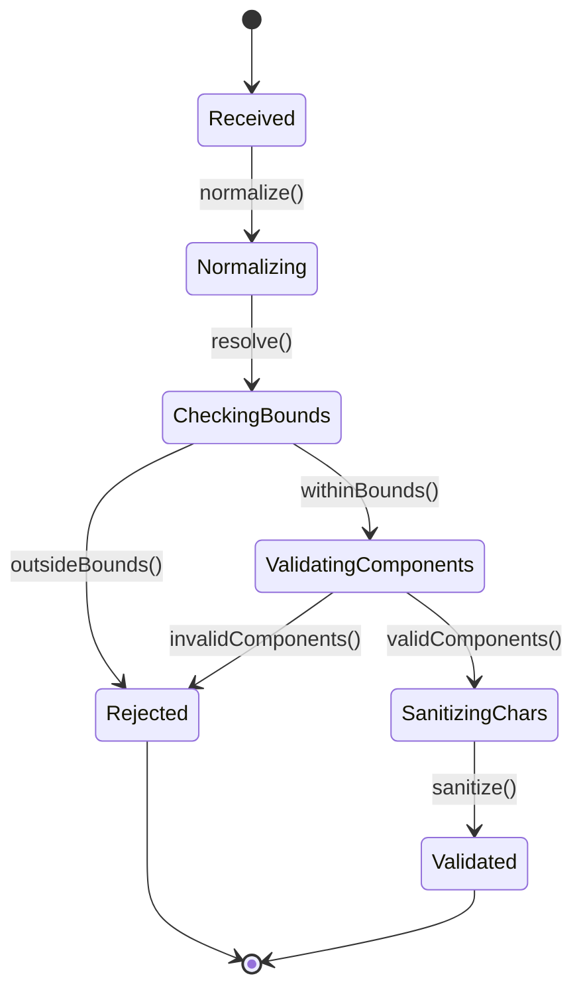
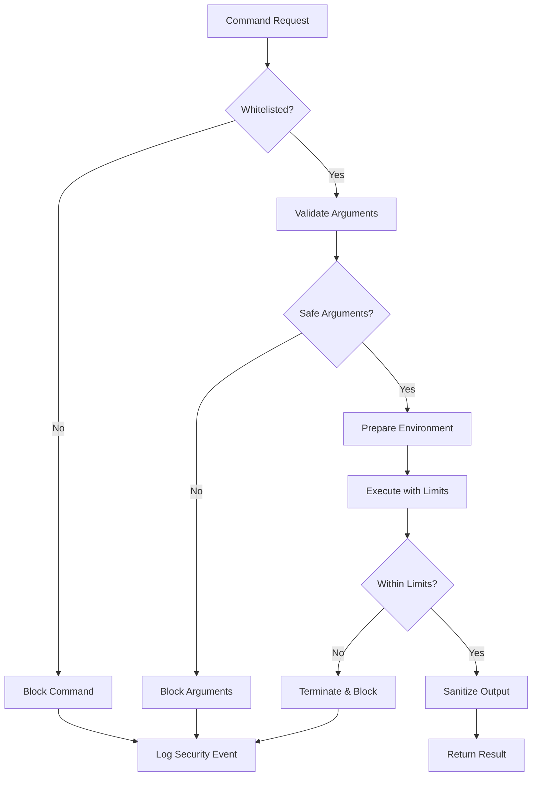
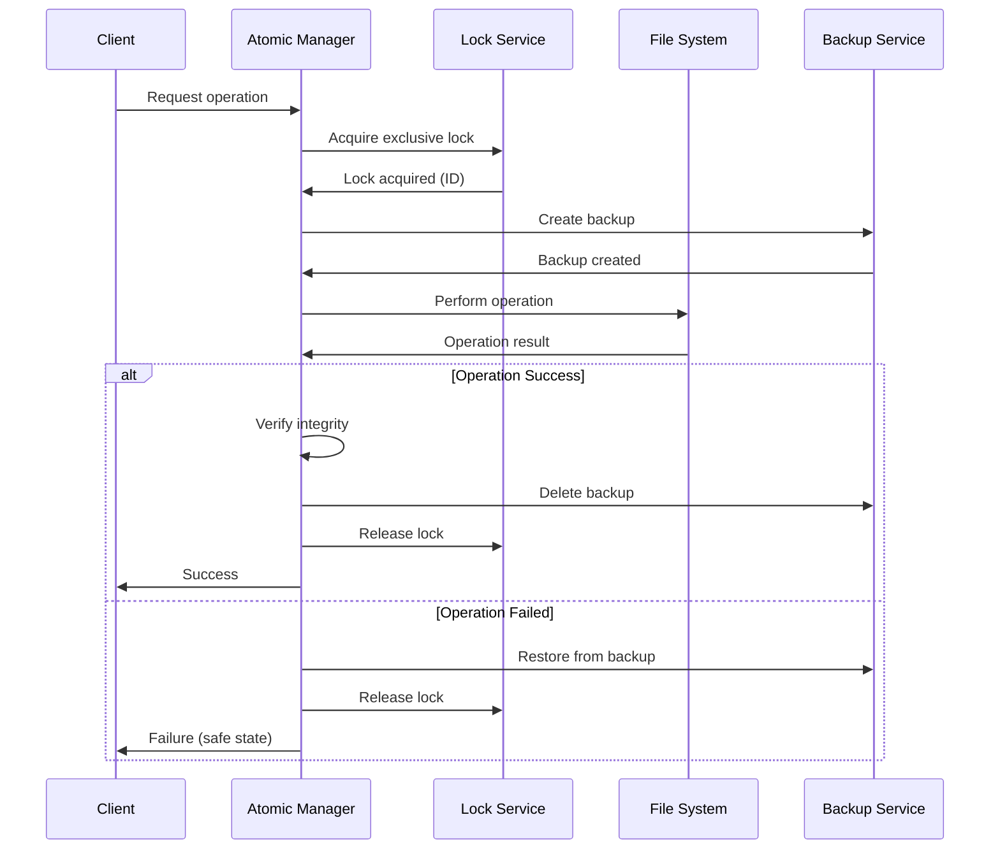
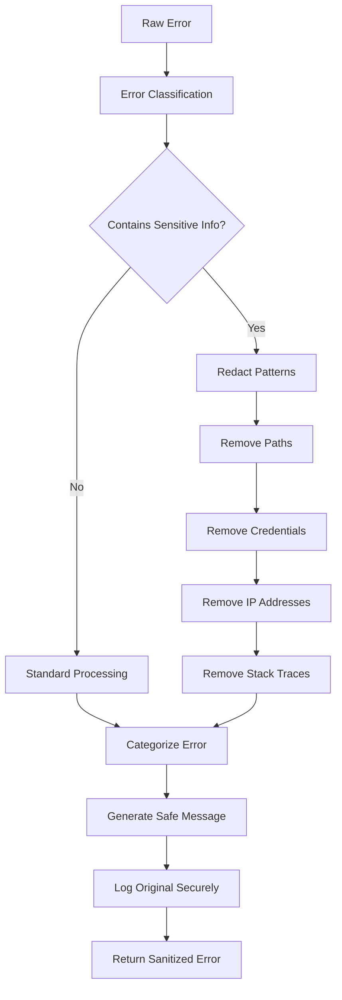
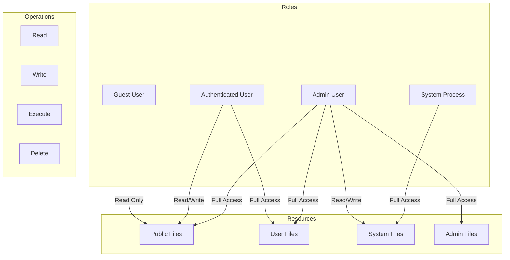
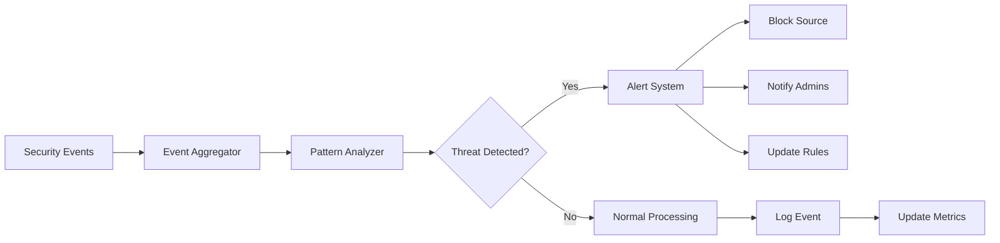

# Security Model

Understanding the comprehensive security framework that protects against various attack vectors.

## 🛡️ Security Philosophy

AI-Proof File Guard follows a **Zero Trust** security model combined with **Defense in Depth** principles.



## 🎯 Threat Model

### Primary Threats



### Attack Vectors & Mitigations

| Attack Vector | Example | Mitigation Strategy |
|---------------|---------|-------------------|
| **Path Traversal** | `../../../etc/passwd` | Path normalization + whitelist validation |
| **Command Injection** | `; rm -rf /` | Command whitelisting + argument sanitization |
| **File Race Conditions** | Simultaneous writes | Atomic operations + file locking |
| **Information Disclosure** | Stack traces in errors | Error message sanitization |
| **Resource Exhaustion** | Infinite loops in scripts | Timeouts + resource limits |

## 🔒 Security Layers

### Layer 1: Input Validation

**Purpose**: First line of defense against malicious input



**Implementation Details**:
```typescript
class InputValidationSecurity {
  private readonly DANGEROUS_PATTERNS = [
    /\.\.\//g,                    // Path traversal
    /[;&|`$(){}[\]]/g,           // Command injection chars
    /<script[\s\S]*?>/gi,        // Script injection
    /javascript:/gi,              // Protocol injection
    /data:.*?base64/gi,          // Data URI attacks
    /\\x[0-9a-f]{2}/gi,          // Hex escape sequences
    /%[0-9a-f]{2}/gi             // URL encoding
  ];

  validateInput(input: unknown): ValidatedInput {
    // Type validation
    if (!this.isValidInputType(input)) {
      throw new SecurityError('INVALID_INPUT_TYPE', 'Input type not allowed');
    }

    // Size limits
    const serialized = JSON.stringify(input);
    if (serialized.length > this.MAX_INPUT_SIZE) {
      throw new SecurityError('INPUT_TOO_LARGE', 'Input exceeds size limit');
    }

    // Pattern detection
    for (const pattern of this.DANGEROUS_PATTERNS) {
      if (pattern.test(serialized)) {
        throw new SecurityError('DANGEROUS_PATTERN', 'Malicious pattern detected');
      }
    }

    return this.sanitizeInput(input);
  }
}
```

### Layer 2: Path Security

**Purpose**: Prevent unauthorized file system access



**Security Features**:
- **Canonical Path Resolution**: Resolves symbolic links and relative paths
- **Boundary Enforcement**: Ensures paths stay within allowed directories
- **Component Validation**: Validates each path component individually
- **Character Sanitization**: Removes or escapes dangerous characters
- **Platform-Specific Checks**: Handles Windows/Unix specific vulnerabilities

```typescript
class PathSecurityModel {
  async validatePath(inputPath: string, rootDir: string): Promise<string> {
    // Step 1: Normalize and resolve
    const normalizedPath = path.resolve(rootDir, inputPath);
    
    // Step 2: Boundary check
    if (!normalizedPath.startsWith(path.resolve(rootDir))) {
      throw new SecurityError('PATH_TRAVERSAL', 'Path outside allowed directory');
    }
    
    // Step 3: Component validation
    const components = normalizedPath.split(path.sep);
    for (const component of components) {
      this.validatePathComponent(component);
    }
    
    // Step 4: Platform-specific validation
    this.validatePlatformSpecific(normalizedPath);
    
    return normalizedPath;
  }

  private validatePathComponent(component: string): void {
    // Check for dangerous components
    if (component === '..' || component === '.') {
      throw new SecurityError('DANGEROUS_COMPONENT', 'Invalid path component');
    }
    
    // Check for Windows reserved names
    if (this.isWindowsReservedName(component)) {
      throw new SecurityError('RESERVED_NAME', 'Windows reserved name');
    }
    
    // Check for dangerous characters
    if (/[<>:"|?*\x00-\x1f]/.test(component)) {
      throw new SecurityError('DANGEROUS_CHARS', 'Invalid characters in path');
    }
  }
}
```

### Layer 3: Command Security

**Purpose**: Secure command execution with strict controls



**Security Controls**:
```typescript
class CommandSecurityModel {
  private readonly ALLOWED_COMMANDS = new Set([
    'ls', 'cat', 'echo', 'chmod', 'mkdir', 'cp', 'mv'
  ]);

  async executeSecurely(command: string, args: string[]): Promise<Result> {
    // Whitelist validation
    if (!this.ALLOWED_COMMANDS.has(command)) {
      throw new SecurityError('COMMAND_NOT_ALLOWED', `Command '${command}' not in whitelist`);
    }

    // Argument validation
    const safeArgs = this.validateArguments(args);
    
    // Environment preparation
    const secureEnv = this.createSecureEnvironment();
    
    // Execution with constraints
    return await this.executeWithConstraints(command, safeArgs, secureEnv);
  }

  private validateArguments(args: string[]): string[] {
    return args.map(arg => {
      // Check for injection attempts
      if (/[;&|`$()]/.test(arg)) {
        throw new SecurityError('DANGEROUS_ARGUMENT', 'Dangerous characters in argument');
      }
      
      // Length validation
      if (arg.length > this.MAX_ARGUMENT_LENGTH) {
        throw new SecurityError('ARGUMENT_TOO_LONG', 'Argument exceeds length limit');
      }
      
      return arg;
    });
  }

  private createSecureEnvironment(): NodeJS.ProcessEnv {
    return {
      PATH: '/usr/bin:/bin',  // Restricted PATH
      HOME: '/tmp/secure',    // Safe home directory
      USER: 'secure',         // Non-privileged user
      SHELL: '/bin/false'     // No shell access
    };
  }
}
```

### Layer 4: Atomic Operations

**Purpose**: Prevent race conditions and ensure data integrity



**Atomicity Guarantees**:
```typescript
class AtomicOperationSecurity {
  async atomicWrite(filePath: string, content: string): Promise<void> {
    const lockId = await this.acquireExclusiveLock(filePath);
    let backupPath: string | null = null;
    
    try {
      // Create backup of existing file
      if (await this.fileExists(filePath)) {
        backupPath = await this.createBackup(filePath);
      }
      
      // Write to temporary file first
      const tempPath = `${filePath}.tmp.${lockId}`;
      await fs.writeFile(tempPath, content);
      
      // Verify integrity
      await this.verifyFileIntegrity(tempPath, content);
      
      // Atomic move to final location
      await fs.rename(tempPath, filePath);
      
      // Clean up backup
      if (backupPath) {
        await fs.unlink(backupPath);
      }
      
    } catch (error) {
      // Restore from backup if needed
      if (backupPath) {
        await fs.copyFile(backupPath, filePath);
        await fs.unlink(backupPath);
      }
      throw error;
      
    } finally {
      await this.releaseLock(filePath, lockId);
    }
  }
}
```

### Layer 5: Error Handling

**Purpose**: Prevent information disclosure through error messages



**Information Protection**:
```typescript
class ErrorHandlingSecurity {
  private readonly SENSITIVE_PATTERNS = [
    /\/[Uu]sers\/[^\/\s]+/g,           // User paths
    /\/home\/[^\/\s]+/g,               // Home directories
    /[Cc]:\\[Uu]sers\\[^\\s]+/g,       // Windows user paths
    /password[=:]\s*\S+/gi,            // Passwords
    /token[=:]\s*\S+/gi,               // Tokens
    /key[=:]\s*\S+/gi,                 // Keys
    /\b\d{1,3}\.\d{1,3}\.\d{1,3}\.\d{1,3}\b/g, // IP addresses
    /[a-f0-9]{32,}/g,                  // Hex strings (hashes)
    /[A-Za-z0-9+\/]{20,}={0,2}/g       // Base64 strings
  ];

  sanitizeError(error: Error, context?: any): SecureError {
    let message = error.message;
    
    // Redact sensitive patterns
    for (const pattern of this.SENSITIVE_PATTERNS) {
      message = message.replace(pattern, '[REDACTED]');
    }
    
    // Sanitize context
    const sanitizedContext = this.sanitizeContext(context);
    
    // Generate secure error
    return {
      message: this.truncateMessage(message),
      code: this.categorizeError(error),
      severity: this.determineSeverity(error),
      timestamp: new Date().toISOString(),
      context: sanitizedContext,
      shouldFailSafe: this.shouldFailSafe(error)
    };
  }
}
```

## 🔐 Access Control Model

### Permission Matrix



### Dynamic Permission Validation

```typescript
class AccessControlSecurity {
  async validateAccess(
    user: User,
    resource: string,
    operation: Operation
  ): Promise<boolean> {
    // Get user permissions
    const permissions = await this.getUserPermissions(user);
    
    // Check resource ownership
    const ownership = await this.getResourceOwnership(resource);
    
    // Validate operation permission
    return this.hasPermission(permissions, ownership, resource, operation);
  }
  
  private hasPermission(
    permissions: Permission[],
    ownership: Ownership,
    resource: string,
    operation: Operation
  ): boolean {
    // Check direct permissions
    if (permissions.some(p => 
      p.resource === resource && 
      p.operations.includes(operation)
    )) {
      return true;
    }
    
    // Check ownership permissions
    if (ownership.owner === permissions.userId) {
      return ownership.ownerPermissions.includes(operation);
    }
    
    // Check group permissions
    if (ownership.group && permissions.groups.includes(ownership.group)) {
      return ownership.groupPermissions.includes(operation);
    }
    
    // Check public permissions
    return ownership.publicPermissions.includes(operation);
  }
}
```

## 📊 Security Metrics & Monitoring

### Real-time Threat Detection



### Security Health Monitoring

```typescript
class SecurityMonitoring {
  async getSecurityHealth(): Promise<SecurityHealth> {
    const metrics = await Promise.all([
      this.checkInputValidationHealth(),
      this.checkPathSecurityHealth(), 
      this.checkCommandSecurityHealth(),
      this.checkFileOperationHealth(),
      this.checkErrorHandlingHealth()
    ]);
    
    return {
      overall: this.calculateOverallHealth(metrics),
      components: metrics,
      threats: await this.getActiveThreats(),
      recommendations: this.generateRecommendations(metrics)
    };
  }
  
  private async getActiveThreats(): Promise<ThreatSummary[]> {
    return [
      {
        type: 'path_traversal',
        count: await this.countRecentEvents('path_traversal'),
        severity: 'high',
        trend: 'increasing'
      },
      {
        type: 'command_injection',
        count: await this.countRecentEvents('command_injection'),
        severity: 'critical',
        trend: 'stable'
      }
    ];
  }
}
```

## 🛠️ Security Configuration

### Hardening Checklist

- ✅ **Input Validation**: All inputs validated and sanitized
- ✅ **Path Security**: Directory traversal protection active
- ✅ **Command Security**: Command whitelist enforced
- ✅ **Atomic Operations**: Race condition protection enabled
- ✅ **Error Sanitization**: Information disclosure prevention active
- ✅ **Resource Limits**: DoS protection configured
- ✅ **Audit Logging**: Security events logged
- ✅ **Monitoring**: Real-time threat detection enabled

### Security Baseline Configuration

```typescript
const SECURITY_BASELINE: SecurityConfiguration = {
  inputValidation: {
    maxInputSize: 1024 * 1024,        // 1MB
    strictTypeChecking: true,
    patternDetection: true,
    characterFiltering: true
  },
  
  pathSecurity: {
    allowedDirectories: ['/safe/workspace'],
    maxPathLength: 1000,
    maxComponentLength: 255,
    strictTraversalPrevention: true,
    unicodeNormalization: true
  },
  
  commandSecurity: {
    whitelistMode: true,
    allowedCommands: ['ls', 'cat', 'echo'],
    maxArgumentLength: 1000,
    timeoutMs: 30000,
    maxOutputSize: 1024 * 1024
  },
  
  errorHandling: {
    sanitizeMessages: true,
    includeStackTrace: false,
    maxMessageLength: 200,
    redactionPatterns: true
  },
  
  monitoring: {
    realTimeDetection: true,
    alertThreshold: 5,
    logLevel: 'security'
  }
};
```

---

*🔒 This security model provides comprehensive protection while maintaining system usability and performance.*