# Security Implementation

Comprehensive guide to the security features and their implementation details.

## 🛡️ Security Implementation Overview

AI-Proof File Guard implements multiple security layers that work together to provide comprehensive protection against various attack vectors.


## 🔒 Command Injection Prevention

### Implementation Strategy

Command injection is prevented through a multi-layered approach:

1. **Command Whitelisting** - Only pre-approved commands are allowed
2. **Argument Sanitization** - All arguments are validated and sanitized
3. **No Shell Execution** - Commands are executed directly without shell interpretation
4. **Environment Isolation** - Secure, minimal environment variables

```mermaid
sequenceDiagram
    participant User
    participant Validator as Command Validator
    participant Whitelist as Command Whitelist
    participant Sanitizer as Argument Sanitizer
    participant Executor as Secure Executor
    
    User->>Validator: executeCommand(cmd, args)
    Validator->>Whitelist: isAllowed(cmd)
    
    alt Command Allowed
        Whitelist->>Validator: ✅ Approved
        Validator->>Sanitizer: sanitizeArgs(args)
        
        alt Arguments Safe
            Sanitizer->>Validator: ✅ Clean args
            Validator->>Executor: execute(cmd, cleanArgs)
            Executor->>User: Result
        else Dangerous Arguments
            Sanitizer->>User: ❌ SecurityError
        end
    else Command Blocked
        Whitelist->>User: ❌ Command not allowed
    end
```



### SecureCommandExecutor Implementation

```typescript
export class SecureCommandExecutor {
  private allowedCommands: Set<string>;
  private options: SecureCommandOptions;

  constructor(allowedCommands: string[], options: SecureCommandOptions = {}) {
    this.allowedCommands = new Set(allowedCommands);
    this.options = {
      timeout: 30000,
      maxOutputSize: 1024 * 1024, // 1MB
      maxArgumentLength: 1000,
      shell: false,
      ...options
    };
  }

  async executeCommand(
    command: string, 
    args: string[], 
    options: Partial<SecureCommandOptions> = {}
  ): Promise<CommandResult> {
    // Step 1: Validate command is whitelisted
    this.validateCommand(command);
    
    // Step 2: Sanitize and validate arguments
    const sanitizedArgs = this.sanitizeArguments(args);
    
    // Step 3: Prepare secure environment
    const secureEnv = this.createSecureEnvironment();
    
    // Step 4: Execute with security constraints
    const result = await this.executeWithConstraints(
      command,
      sanitizedArgs,
      { ...this.options, ...options },
      secureEnv
    );
    
    return result;
  }

  private validateCommand(command: string): void {
    // Check whitelist
    if (!this.allowedCommands.has(command)) {
      throw new SecurityError(
        'COMMAND_NOT_ALLOWED',
        `Command '${command}' is not in the allowed list`
      );
    }

    // Prevent path-based command execution
    if (command.includes('/') || command.includes('\\')) {
      throw new SecurityError(
        'COMMAND_PATH_NOT_ALLOWED',
        'Commands with path separators are not allowed'
      );
    }
  }

  private sanitizeArguments(args: string[]): string[] {
    return args.map((arg, index) => {
      // Type validation
      if (typeof arg !== 'string') {
        throw new SecurityError(
          'INVALID_ARGUMENT_TYPE',
          `Argument ${index} must be a string`
        );
      }

      // Length validation
      if (arg.length > this.options.maxArgumentLength) {
        throw new SecurityError(
          'ARGUMENT_TOO_LONG',
          `Argument ${index} exceeds maximum length`
        );
      }

      // Dangerous character detection
      const dangerousChars = /[;&|`$(){}[\]<>'"\\]/;
      if (dangerousChars.test(arg)) {
        throw new SecurityError(
          'DANGEROUS_CHARACTERS',
          `Dangerous characters in argument ${index}`
        );
      }

      // Null byte injection prevention
      if (arg.includes('\0')) {
        throw new SecurityError(
          'NULL_BYTE_INJECTION',
          `Null byte detected in argument ${index}`
        );
      }

      return arg;
    });
  }

  private createSecureEnvironment(): NodeJS.ProcessEnv {
    return {
      PATH: '/usr/bin:/bin',
      HOME: '/tmp/secure',
      USER: 'secure',
      SHELL: '/bin/false',
      // Remove potentially dangerous variables
      LD_PRELOAD: undefined,
      LD_LIBRARY_PATH: undefined
    };
  }

  private async executeWithConstraints(
    command: string,
    args: string[],
    options: SecureCommandOptions,
    env: NodeJS.ProcessEnv
  ): Promise<CommandResult> {
    const startTime = Date.now();

    try {
      const result = await execa(command, args, {
        shell: false, // Critical: no shell interpretation
        timeout: options.timeout,
        maxBuffer: options.maxOutputSize,
        env: env,
        stdio: 'pipe',
        windowsHide: true,
        killSignal: 'SIGKILL'
      });

      return {
        stdout: String(result.stdout || ''),
        stderr: String(result.stderr || ''),
        exitCode: result.exitCode || 0,
        duration: Date.now() - startTime,
        command: command,
        args: args
      };

    } catch (error) {
      if (error.timedOut) {
        throw new SecurityError(
          'COMMAND_TIMEOUT',
          `Command timed out after ${options.timeout}ms`
        );
      }

      if (error.maxBuffer) {
        throw new SecurityError(
          'OUTPUT_TOO_LARGE',
          'Command output exceeds maximum size'
        );
      }

      throw new SecurityError(
        'COMMAND_EXECUTION_FAILED',
        `Command execution failed: ${error.message}`
      );
    }
  }
}
```

### Attack Prevention Examples

```typescript
// ❌ These attacks are prevented:

// Command chaining
await executor.executeCommand('ls', ['; rm -rf /']);
// → SecurityError: Dangerous characters in argument

// Command substitution
await executor.executeCommand('echo', ['$(whoami)']);
// → SecurityError: Dangerous characters in argument

// Background processes
await executor.executeCommand('echo', ['test & malicious-process']);
// → SecurityError: Dangerous characters in argument

// Unauthorized commands
await executor.executeCommand('rm', ['-rf', '/']);
// → SecurityError: Command 'rm' is not in the allowed list

// ✅ Safe operations:
await executor.executeCommand('ls', ['-la', '/safe/directory']);
await executor.executeCommand('echo', ['Hello, World!']);
await executor.executeCommand('cat', ['config.json']);
```

## 🛣️ Path Traversal Protection

### Implementation Strategy

Path traversal attacks are prevented through comprehensive path validation:


### SecurePathValidator Implementation

```typescript
export class SecurePathValidator {
  private allowedDirectories: string[];
  private options: PathValidationOptions;

  constructor(allowedDirectories: string[], options: PathValidationOptions = {}) {
    this.allowedDirectories = allowedDirectories.map(dir => path.resolve(dir));
    this.options = {
      maxPathLength: 1000,
      maxComponentLength: 255,
      allowSymlinks: false,
      strictMode: true,
      ...options
    };
  }

  async validateAndSanitizePath(
    inputPath: string, 
    rootDir?: string
  ): Promise<string> {
    // Input validation
    if (!inputPath || typeof inputPath !== 'string') {
      throw new SecurityError('INVALID_PATH', 'Path must be a non-empty string');
    }

    // Length validation
    if (inputPath.length > this.options.maxPathLength) {
      throw new SecurityError('PATH_TOO_LONG', 'Path exceeds maximum length');
    }

    // Normalize the path
    const normalizedPath = this.normalizePath(inputPath, rootDir);
    
    // Validate path components
    await this.validatePathComponents(normalizedPath);
    
    // Check directory boundaries
    this.enforceDirectoryBoundaries(normalizedPath);
    
    // Platform-specific validation
    this.validatePlatformSpecific(normalizedPath);
    
    return normalizedPath;
  }

  private normalizePath(inputPath: string, rootDir?: string): string {
    // Remove dangerous sequences early
    let cleanPath = inputPath;
    
    // Decode URL encoding (multiple times to catch double encoding)
    for (let i = 0; i < 3; i++) {
      try {
        const decoded = decodeURIComponent(cleanPath);
        if (decoded === cleanPath) break;
        cleanPath = decoded;
      } catch {
        break; // Stop if decoding fails
      }
    }

    // Unicode normalization to prevent bypass attempts
    cleanPath = cleanPath.normalize('NFC');

    // Resolve relative to root directory if provided
    if (rootDir) {
      return path.resolve(rootDir, cleanPath);
    }

    // Make absolute if not already
    return path.resolve(cleanPath);
  }

  private async validatePathComponents(fullPath: string): Promise<void> {
    const components = fullPath.split(path.sep).filter(Boolean);
    
    for (const component of components) {
      // Length check
      if (component.length > this.options.maxComponentLength) {
        throw new SecurityError(
          'PATH_COMPONENT_TOO_LONG',
          'Path component exceeds maximum length'
        );
      }

      // Dangerous component check
      if (component === '..' || component === '.') {
        throw new SecurityError(
          'PATH_TRAVERSAL_ATTEMPT',
          'Path traversal attempt detected'
        );
      }

      // Windows reserved names
      if (this.isWindowsReservedName(component)) {
        throw new SecurityError(
          'WINDOWS_RESERVED_NAME',
          `Windows reserved name detected: ${component}`
        );
      }

      // Dangerous characters
      if (/[<>:"|?*\x00-\x1f\x7f]/.test(component)) {
        throw new SecurityError(
          'DANGEROUS_PATH_CHARACTERS',
          'Dangerous characters in path component'
        );
      }
    }
  }

  private enforceDirectoryBoundaries(fullPath: string): void {
    const resolvedPath = path.resolve(fullPath);
    
    // Check if path is within any allowed directory
    const isAllowed = this.allowedDirectories.some(allowedDir => {
      const resolved = path.resolve(allowedDir);
      return resolvedPath.startsWith(resolved + path.sep) || 
             resolvedPath === resolved;
    });

    if (!isAllowed) {
      throw new SecurityError(
        'PATH_OUTSIDE_ALLOWED_DIRECTORIES',
        'Path is outside allowed directories'
      );
    }
  }

  private validatePlatformSpecific(fullPath: string): void {
    if (process.platform === 'win32') {
      // Windows-specific validations
      
      // UNC path prevention
      if (fullPath.startsWith('\\\\')) {
        throw new SecurityError(
          'UNC_PATH_NOT_ALLOWED',
          'UNC paths are not allowed'
        );
      }

      // Drive letter validation
      if (/^[A-Za-z]:/.test(fullPath)) {
        const driveLetter = fullPath.charAt(0).toUpperCase();
        if (!this.allowedDirectories.some(dir => 
          dir.startsWith(driveLetter + ':')
        )) {
          throw new SecurityError(
            'DRIVE_ACCESS_NOT_ALLOWED',
            `Access to drive ${driveLetter}: not allowed`
          );
        }
      }
    } else {
      // Unix-specific validations
      
      // Prevent access to system directories
      const dangerousPaths = ['/etc', '/proc', '/sys', '/dev'];
      if (dangerousPaths.some(dangerous => fullPath.startsWith(dangerous))) {
        if (!this.allowedDirectories.some(allowed => 
          fullPath.startsWith(allowed)
        )) {
          throw new SecurityError(
            'SYSTEM_PATH_ACCESS_DENIED',
            'Access to system paths denied'
          );
        }
      }
    }
  }

  private isWindowsReservedName(name: string): boolean {
    const reserved = [
      'CON', 'PRN', 'AUX', 'NUL',
      'COM1', 'COM2', 'COM3', 'COM4', 'COM5', 'COM6', 'COM7', 'COM8', 'COM9',
      'LPT1', 'LPT2', 'LPT3', 'LPT4', 'LPT5', 'LPT6', 'LPT7', 'LPT8', 'LPT9'
    ];
    
    const baseName = name.split('.')[0].toUpperCase();
    return reserved.includes(baseName);
  }

  sanitizeConfigFilename(filename: string): string {
    if (!filename || typeof filename !== 'string') {
      throw new SecurityError('INVALID_FILENAME', 'Invalid filename');
    }

    // Remove path separators
    let sanitized = filename.replace(/[/\\]/g, '_');
    
    // Remove dangerous characters
    sanitized = sanitized.replace(/[<>:"|?*\x00-\x1f\x7f]/g, '_');
    
    // Handle Windows reserved names
    if (this.isWindowsReservedName(sanitized)) {
      sanitized = '_' + sanitized;
    }
    
    // Prevent hidden files (optional)
    if (sanitized.startsWith('.')) {
      sanitized = '_' + sanitized;
    }
    
    // Length limit
    if (sanitized.length > 255) {
      const ext = path.extname(sanitized);
      const base = path.basename(sanitized, ext);
      sanitized = base.substring(0, 255 - ext.length) + ext;
    }
    
    // Ensure not empty
    if (!sanitized || sanitized === '.' || sanitized === '..') {
      sanitized = 'sanitized_file';
    }
    
    return sanitized;
  }
}
```

### Path Attack Prevention Examples

```typescript
// ❌ These attacks are prevented:

// Directory traversal
await validator.validateAndSanitizePath('../../../etc/passwd');
// → SecurityError: Path traversal attempt detected

// Encoded traversal
await validator.validateAndSanitizePath('..%2F..%2F..%2Fetc%2Fpasswd');
// → SecurityError: Path traversal attempt detected

// Unicode normalization bypass
await validator.validateAndSanitizePath('\u002e\u002e\u002f\u002e\u002e\u002f');
// → SecurityError: Path traversal attempt detected

// Windows device names
await validator.validateAndSanitizePath('CON');
// → SecurityError: Windows reserved name detected

// ✅ Safe operations:
await validator.validateAndSanitizePath('./safe/file.txt');
await validator.validateAndSanitizePath('documents/readme.md');
```

## 🔐 Atomic File Operations

### Implementation Strategy

Race conditions are prevented through atomic file operations with proper locking:


### AtomicFileManager Implementation

```typescript
export class AtomicFileManager {
  private locks = new Map<string, LockInfo>();
  private rootDirectory: string;
  private options: AtomicOperationOptions;

  constructor(rootDirectory: string, options: AtomicOperationOptions = {}) {
    this.rootDirectory = path.resolve(rootDirectory);
    this.options = {
      lockTimeout: 30000,
      backupEnabled: true,
      integrityChecks: true,
      ...options
    };
  }

  async acquireLock(
    filePath: string, 
    options: Partial<AtomicOperationOptions> = {}
  ): Promise<string> {
    const fullPath = path.resolve(this.rootDirectory, filePath);
    const lockId = this.generateLockId();
    const timeout = options.lockTimeout || this.options.lockTimeout;

    try {
      // Use proper-lockfile for process-level locking
      await lock(fullPath, {
        retries: {
          retries: Math.floor(timeout / 1000),
          factor: 1,
          minTimeout: 1000,
          maxTimeout: 1000
        },
        stale: timeout,
        realpath: false
      });

      // Store lock information
      const lockInfo: LockInfo = {
        lockId,
        filePath: fullPath,
        timestamp: Date.now(),
        pid: process.pid,
        userId: process.getuid?.() || 0
      };

      // Add integrity checksum if requested
      if (options.checkIntegrity || this.options.integrityChecks) {
        try {
          const content = await fs.readFile(fullPath, 'utf-8');
          lockInfo.checksum = this.calculateChecksum(content);
        } catch {
          // File might not exist yet, that's ok
        }
      }

      this.locks.set(fullPath, lockInfo);
      return lockId;

    } catch (error) {
      throw new SecurityError(
        'LOCK_ACQUISITION_FAILED',
        `Failed to acquire lock: ${error.message}`
      );
    }
  }

  async releaseLock(filePath: string, lockId: string): Promise<void> {
    const fullPath = path.resolve(this.rootDirectory, filePath);
    const lockInfo = this.locks.get(fullPath);

    if (!lockInfo || lockInfo.lockId !== lockId) {
      throw new SecurityError(
        'INVALID_LOCK_ID',
        'Lock is not acquired/owned by you'
      );
    }

    try {
      await unlock(fullPath);
      this.locks.delete(fullPath);
    } catch (error) {
      throw new SecurityError(
        'LOCK_RELEASE_FAILED',
        `Failed to release lock: ${error.message}`
      );
    }
  }

  async atomicWrite(
    filePath: string, 
    content: string, 
    options: Partial<AtomicOperationOptions> = {}
  ): Promise<void> {
    const fullPath = path.resolve(this.rootDirectory, filePath);
    let lockId: string | null = null;
    let backupPath: string | null = null;

    try {
      // Acquire exclusive lock
      lockId = await this.acquireLock(filePath, options);

      // Create backup if file exists and backup is enabled
      if ((options.backup ?? this.options.backupEnabled) && 
          await this.fileExists(fullPath)) {
        backupPath = await this.createBackup(fullPath);
      }

      // Write to temporary file first
      const tempPath = `${fullPath}.tmp.${lockId}`;
      await writeFileAtomic(tempPath, content, {
        mode: 0o644,
        chown: false
      });

      // Verify integrity if requested
      if (options.checkIntegrity || this.options.integrityChecks) {
        await this.verifyFileIntegrity(tempPath, content);
      }

      // Atomic move to final location
      await fs.rename(tempPath, fullPath);

      // Clean up backup on success
      if (backupPath) {
        await fs.unlink(backupPath);
      }

    } catch (error) {
      // Restore from backup if operation failed
      if (backupPath && await this.fileExists(backupPath)) {
        try {
          await fs.copyFile(backupPath, fullPath);
          await fs.unlink(backupPath);
        } catch (restoreError) {
          // Log restore failure but don't mask original error
          console.error('Failed to restore backup:', restoreError);
        }
      }

      throw new SecurityError(
        'ATOMIC_WRITE_FAILED',
        `Atomic write failed: ${error.message}`
      );

    } finally {
      // Always release lock
      if (lockId) {
        try {
          await this.releaseLock(filePath, lockId);
        } catch (unlockError) {
          console.error('Failed to release lock:', unlockError);
        }
      }
    }
  }

  async atomicRead(
    filePath: string, 
    options: Partial<AtomicOperationOptions> = {}
  ): Promise<string> {
    const fullPath = path.resolve(this.rootDirectory, filePath);
    let lockId: string | null = null;

    try {
      // Acquire shared lock for reading
      lockId = await this.acquireLock(filePath, {
        ...options,
        lockType: 'shared'
      });

      // Read file content
      const content = await fs.readFile(fullPath, 'utf-8');

      // Verify integrity if requested
      if (options.checkIntegrity || this.options.integrityChecks) {
        const lockInfo = this.locks.get(fullPath);
        if (lockInfo?.checksum) {
          const currentChecksum = this.calculateChecksum(content);
          if (currentChecksum !== lockInfo.checksum) {
            throw new SecurityError(
              'INTEGRITY_VERIFICATION_FAILED',
              'File integrity verification failed'
            );
          }
        }
      }

      return content;

    } catch (error) {
      throw new SecurityError(
        'ATOMIC_READ_FAILED',
        `Atomic read failed: ${error.message}`
      );

    } finally {
      if (lockId) {
        await this.releaseLock(filePath, lockId);
      }
    }
  }

  private async createBackup(filePath: string): Promise<string> {
    const backupPath = `${filePath}.backup.${Date.now()}`;
    await fs.copyFile(filePath, backupPath);
    return backupPath;
  }

  private async verifyFileIntegrity(filePath: string, expectedContent: string): Promise<void> {
    const actualContent = await fs.readFile(filePath, 'utf-8');
    if (actualContent !== expectedContent) {
      throw new SecurityError(
        'INTEGRITY_VERIFICATION_FAILED',
        'File content does not match expected content'
      );
    }
  }

  private calculateChecksum(content: string): string {
    return crypto.createHash('sha256').update(content).digest('hex');
  }

  private generateLockId(): string {
    return crypto.randomBytes(16).toString('hex');
  }

  private async fileExists(filePath: string): Promise<boolean> {
    try {
      await fs.access(filePath);
      return true;
    } catch {
      return false;
    }
  }

  async isFileLocked(filePath: string): Promise<boolean> {
    const fullPath = path.resolve(this.rootDirectory, filePath);
    return this.locks.has(fullPath);
  }

  async forceReleaseLock(filePath: string): Promise<void> {
    const fullPath = path.resolve(this.rootDirectory, filePath);
    
    try {
      await unlock(fullPath);
      this.locks.delete(fullPath);
    } catch (error) {
      // Force release even if unlock fails
      this.locks.delete(fullPath);
    }
  }

  async cleanup(): Promise<void> {
    // Release all locks held by this manager
    const lockPaths = Array.from(this.locks.keys());
    
    await Promise.all(
      lockPaths.map(async (lockPath) => {
        try {
          await unlock(lockPath);
        } catch {
          // Ignore cleanup errors
        }
      })
    );
    
    this.locks.clear();
  }
}
```

This comprehensive security implementation provides robust protection against all major attack vectors while maintaining performance and usability. Each component is designed to fail safely and provide detailed security event logging for monitoring and analysis.