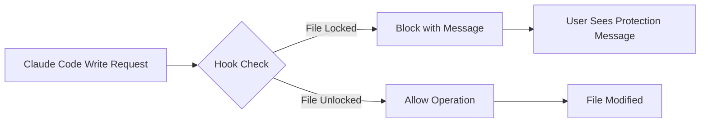

# Claude Code Integration

> Seamless protection for your sensitive files when using Claude Code

## Overview

The AILock Claude Code integration provides automatic protection for your locked files when using Claude Code. Through the power of Claude Code hooks, ailock can prevent accidental modifications while maintaining full read access for AI context understanding.

## How It Works

The integration uses Claude Code's PreToolUse hooks to intercept file modification attempts:

1. **Intercepts Write Operations**: Captures Write, Edit, MultiEdit, and NotebookEdit tool calls
2. **Checks Protection Status**: Runs `ailock status` to verify if the file is protected
3. **Blocks or Allows**: Denies modifications to locked files with clear feedback
4. **Maintains Readability**: Read operations continue normally for AI context



## Installation

### Automatic Installation (NEW - Recommended)

Claude Code hooks are now automatically installed when you initialize AILock:

```bash
# Initialize AILock in your project
ailock init
```

This will:
- ✅ Detect Claude Code automatically
- ✅ Install protection hooks seamlessly  
- ✅ Configure settings correctly
- ✅ Complete in under 10 seconds
- ✅ Show clear success messages

To skip automatic hook installation:
```bash
ailock init --no-ai-hooks
```

### Semi-Automatic Installation

If you already have AILock configured but want to add Claude Code hooks:

```bash
# Run the installation script
./node_modules/@code-is-cheap/ailock/hooks/install.sh
```

The installer will:
- ✅ Check ailock installation
- ✅ Make hook script executable
- ✅ Merge settings into Claude Code configuration
- ✅ Create backup of existing settings
- ✅ Verify installation success

### Manual Installation

1. **Locate your Claude Code settings file**:
   - Project-specific: `.claude/settings.json`
   - User-wide: `~/.claude/settings.json`

2. **Add the hook configuration**:

```json
{
  "hooks": {
    "PreToolUse": [
      {
        "matcher": "Write|Edit|MultiEdit|NotebookEdit",
        "hooks": [
          {
            "type": "command",
            "command": "/path/to/ailock/hooks/claude-ailock-hook.js",
            "timeout": 5000
          }
        ]
      }
    ]
  }
}
```

3. **Update the command path** to point to your ailock installation:
   - Global install: `/usr/local/lib/node_modules/@code-is-cheap/ailock/hooks/claude-ailock-hook.js`
   - Local install: `./node_modules/@code-is-cheap/ailock/hooks/claude-ailock-hook.js`
   - Project path: `$CLAUDE_PROJECT_DIR/hooks/claude-ailock-hook.js`

## Usage Examples

### Basic Workflow

```bash
# 1. Lock sensitive files
ailock lock .env database.json secrets/

# 2. Use Claude Code normally
claude "Update the API configuration"
# Claude can read .env for context but cannot modify it

# 3. When you need to edit a protected file
ailock unlock .env
# Make your changes
ailock lock .env
```

### Protection in Action

When Claude Code attempts to modify a protected file, you'll see:

```
🔒 File is protected by ailock. Run 'ailock unlock config.json' to allow modifications.
```

### Common Scenarios

#### Protecting Environment Variables
```bash
ailock lock .env .env.local .env.production
# Claude Code can read environment variables for context
# But cannot accidentally expose or modify them
```

#### Protecting Configuration Files
```bash
ailock lock package-lock.json yarn.lock Gemfile.lock
# Prevents accidental dependency modifications
```

#### Protecting Deployment Files
```bash
ailock lock docker-compose.yml k8s/ .github/workflows/
# Keeps production configs safe from AI modifications
```

## Configuration Options

### Hook Settings

| Option | Description | Default |
|--------|------------|---------|
| `timeout` | Maximum execution time for hook (ms) | 5000 |
| `matcher` | Tools to intercept | "Write\|Edit\|MultiEdit\|NotebookEdit" |

### Environment Variables

The hook respects these environment variables:

- `CLAUDE_PROJECT_DIR`: Automatically set by Claude Code to project root
- `DEBUG`: Set to `true` for verbose logging

## Troubleshooting

### Hook Not Triggering

1. **Verify installation**:
```bash
# Check if hook is in settings
cat ~/.claude/settings.json | grep ailock
```

2. **Check hook script permissions**:
```bash
ls -la /path/to/ailock/hooks/claude-ailock-hook.js
# Should show executable permissions (x)
```

3. **Test hook directly**:
```bash
echo '{"tool_name":"Write","tool_input":{"file_path":"test.txt"}}' | \
  /path/to/ailock/hooks/claude-ailock-hook.js
```

### AILock Command Not Found

If the hook reports "ailock command not found":

1. **Global installation**:
```bash
npm install -g ailock
```

2. **Local installation**:
```bash
npm install --save-dev @code-is-cheap/ailock
# Update hook to use: ./node_modules/.bin/ailock
```

### Permission Denied Errors

```bash
# Make hook executable
chmod +x /path/to/ailock/hooks/claude-ailock-hook.js

# Ensure ailock has proper permissions
ailock diagnose
```

## Technical Details

### Hook Input Format

The hook receives JSON via stdin:

```json
{
  "tool_name": "Write",
  "tool_input": {
    "file_path": "/path/to/file.txt",
    "content": "new content"
  },
  "cwd": "/current/working/directory"
}
```

### Hook Response Format

For blocked operations:

```json
{
  "hookSpecificOutput": {
    "hookEventName": "PreToolUse",
    "permissionDecision": "deny",
    "permissionDecisionReason": "File is protected by ailock..."
  }
}
```

### Supported Tools

| Tool | File Path Location | Description |
|------|-------------------|-------------|
| Write | `tool_input.file_path` | Creates/overwrites files |
| Edit | `tool_input.file_path` | Modifies existing files |
| MultiEdit | `tool_input.file_path` | Multiple edits to one file |
| NotebookEdit | `tool_input.notebook_path` | Jupyter notebook edits |

## Security Considerations

### Fail-Safe Design

- ✅ **Non-blocking errors**: Hook failures don't prevent Claude Code operation
- ✅ **No sensitive data exposure**: Hook never logs file contents
- ✅ **Graceful degradation**: Works even if ailock isn't installed
- ✅ **Clear audit trail**: All blocks are logged with reasons

### Best Practices

1. **Regular Updates**: Keep ailock and hooks updated
2. **Backup Settings**: The installer creates automatic backups
3. **Test Protection**: Verify protection works before relying on it
4. **Monitor Logs**: Check Claude Code logs for hook execution

## Advanced Usage

### Custom Hook Modifications

You can extend the hook for additional functionality:

```javascript
// In claude-ailock-hook.js
async function checkCustomRules(filePath) {
  // Add custom protection logic
  if (filePath.includes('production')) {
    return true; // Always protect production files
  }
  return false;
}
```

### Integration with CI/CD

```yaml
# .github/workflows/protect.yml
- name: Setup AILock Protection
  run: |
    npm install -g ailock
    ailock lock .env secrets/
    ./hooks/install.sh
```

## Frequently Asked Questions

### Q: Does this slow down Claude Code?

A: The hook adds minimal overhead (typically <100ms) and has a 5-second timeout to prevent hanging.

### Q: Can I temporarily disable the hook?

A: Yes, either:
- Remove the hook from Claude Code settings
- Unlock files with `ailock unlock`
- Use the `/hooks` command in Claude Code to manage hooks

### Q: Does this work with all versions of Claude Code?

A: Yes, the hook system is available in all recent versions of Claude Code that support the hooks feature.

### Q: What happens if ailock isn't installed?

A: The hook fails gracefully and allows operations to continue normally, with a warning logged.

## Getting Help

- **Documentation**: [AILock README](../README.md)
- **Issues**: [GitHub Issues](https://github.com/daymade/ailock/issues)
- **Claude Code Hooks**: [Official Documentation](https://docs.anthropic.com/en/docs/claude-code/hooks)

## Contributing

We welcome contributions! See our [Contributing Guide](../CONTRIBUTING.md) for details.

## License

MIT License - See [LICENSE](../LICENSE) for details.