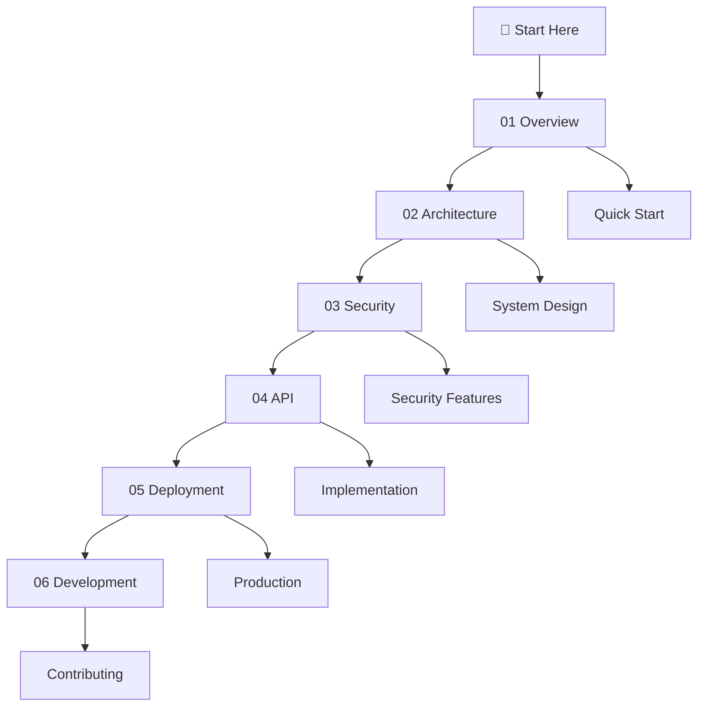

# AI-Proof File Guard Documentation

Welcome to the comprehensive documentation for AI-Proof File Guard - a robust security system for protecting file operations from malicious AI interactions.

## 📚 Documentation Structure

This documentation is organized in a logical progression from overview to implementation details:

### [01 - Overview](./01-overview/)
- [Project Introduction](./01-overview/01-introduction.md)
- [Quick Start Guide](./01-overview/02-quick-start.md)
- [Use Cases & Examples](./01-overview/03-use-cases.md)

### [02 - Architecture](./02-architecture/)
- [System Architecture](./02-architecture/01-system-architecture.md)
- [Security Model](./02-architecture/02-security-model.md)
- [Component Overview](./02-architecture/03-components.md)

### [03 - Security](./03-security/)
- [Security Implementation](./03-security/01-security-implementation.md)
- [Threat Protection](./03-security/02-threat-protection.md)
- [Best Practices](./03-security/03-best-practices.md)

### [04 - API](./04-api/)
- [Core API Reference](./04-api/01-core-api.md)
- [Security Modules](./04-api/02-security-modules.md)
- [Configuration Options](./04-api/03-configuration.md)

### [05 - Deployment](./05-deployment/)
- [Installation Guide](./05-deployment/01-installation.md)
- [Configuration Setup](./05-deployment/02-configuration.md)
- [Production Deployment](./05-deployment/03-production.md)

### [06 - Development](./06-development/)
- [Development Setup](./06-development/01-development-setup.md)
- [Testing Guide](./06-development/02-testing.md)
- [Contributing Guidelines](./06-development/03-contributing.md)

## 🚀 Quick Navigation

## 🔍 Find What You Need

| I want to... | Go to |
|--------------|--------|
| Understand what AI-Proof File Guard does | [Introduction](./01-overview/01-introduction.md) |
| Get started quickly | [Quick Start Guide](./01-overview/02-quick-start.md) |
| Understand the architecture | [System Architecture](./02-architecture/01-system-architecture.md) |
| Learn about security features | [Security Implementation](./03-security/01-security-implementation.md) |
| Use the API | [Core API Reference](./04-api/01-core-api.md) |
| Deploy to production | [Production Deployment](./05-deployment/03-production.md) |
| Contribute to the project | [Contributing Guidelines](./06-development/03-contributing.md) |

## 💡 Key Features

- 🛡️ **Command Injection Prevention** - Secure command execution with whitelisting
- 🔒 **Path Traversal Protection** - Comprehensive path validation and sanitization
- ⚡ **Atomic File Operations** - Race condition prevention with proper locking
- 🚨 **Secure Error Handling** - Information disclosure prevention
- 🔍 **Input Validation** - Multi-layer security filtering
- 📋 **Comprehensive Logging** - Audit trail for security events

## 📊 Project Status

✅ **Production Ready** - All core security features implemented and tested

- Command injection prevention: **ACTIVE**
- Path traversal protection: **ACTIVE** 
- Atomic file operations: **ACTIVE**
- Error sanitization: **ACTIVE**
- Input validation: **ACTIVE**

---

## 🆘 Need Help?

- 📖 Check the relevant documentation section above
- 🐛 Report issues in the GitHub repository
- 💬 Join our community discussions
- 📧 Contact the development team

**Happy securing! 🔐**